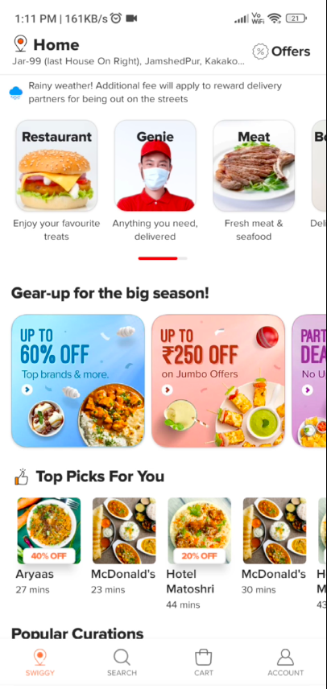
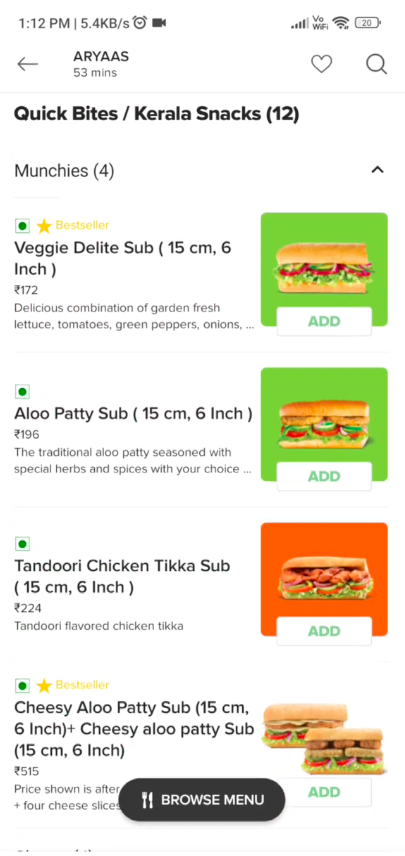
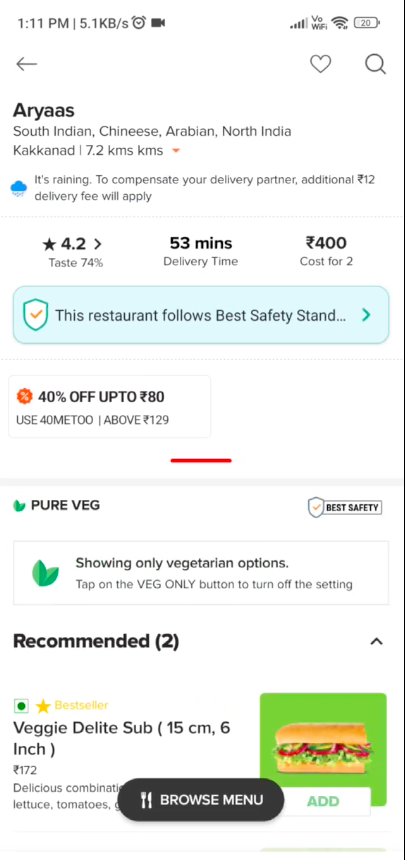
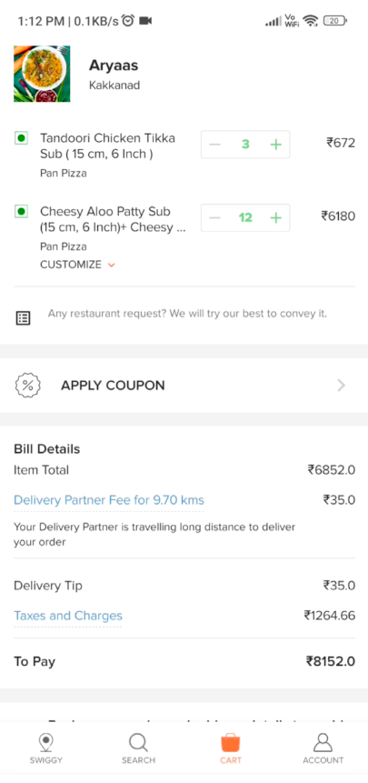

# 🍔 Food Ordering App — Jetpack Compose

An Android food-ordering application inspired by Swiggy's UX, built to demonstrate a modern, fully declarative UI using **Jetpack Compose** alongside solid architectural principles.


---

## 📱 Overview

This project recreates the core browsing and ordering experience of a food delivery platform — restaurant discovery, menu browsing, and cart management — as a way to practice building a polished, production-style UI entirely in Compose, without relying on legacy XML layouts.

## 🖼️ Screenshots

| Restaurant List | Restaurant Details | Menu | Cart |
|---|---|---|---|
|  |  |  |  |

## 🚀 Key Features

- Browse a list of restaurants with images, ratings, and cuisine tags
- View detailed restaurant menus with item pricing and descriptions
- Add and remove items from a cart
- Smooth, animated Compose UI following Material Design guidelines
- Modular, reusable composable components

## 🧠 Architecture & Design Principles

The app is structured around **SOLID design principles** to keep the codebase maintainable and extensible:

- **Single Responsibility** — each composable and class handles one clear concern
- **Reusable components** — shared composables (cards, buttons, list items) used across multiple screens instead of duplicated UI code
- **Separation of UI and state** — screens observe state rather than manage it directly, keeping UI logic predictable and testable

## 🛠️ Tech Stack

| Category | Tools |
|---|---|
| Language | Kotlin |
| UI Toolkit | Jetpack Compose |
| Design | Material Design Components |
| Architecture | MVVM-oriented, SOLID principles |

## ⚙️ Getting Started

```bash
git clone https://github.com/Diptanil-Sen/Food-Delivery-App-Jetpack-Compose.git
```
1. Open in Android Studio
2. Sync Gradle
3. Run on an emulator or physical device

## 📌 What This Project Demonstrates

- Building complex, multi-screen UIs entirely in Jetpack Compose
- Applying SOLID principles to a mobile codebase
- Creating a scalable component library within an app
- Recreating a real-world product's core user flow from scratch

## 🔭 Possible Future Improvements

- Live order tracking screen
- Search and filter by cuisine/rating
- User authentication and saved addresses
- Checkout and payment flow (mocked)
